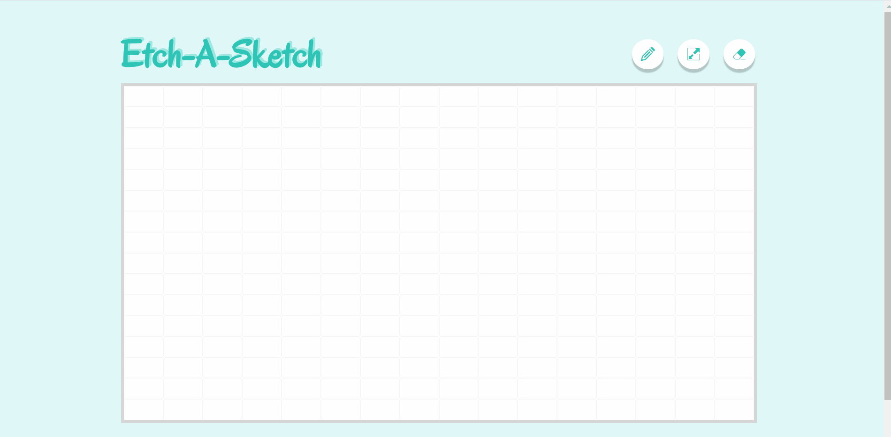

# Etch A Sketch

A drawing application similar to an [etch-a-sketch](https://en.wikipedia.org/wiki/Etch_A_Sketch) drawing device, with additional sketchpad features (mentioned below).

## Demo

Create your own custom drawings by [visiting the site](https://pa-aggarwal.github.io/etch-a-sketch/).

## Motivation

The primary incentive for this project is to learn how to manipulate the Document Object Model (DOM) and respond to events caused by user interactions with a webpage.

## Technologies Used

* HTML5/CSS3
* JavaScript ES6

## Features

* Change color of drawing pencil.
* Customize sketchpad grid-cell size for precise drawing.
* Clear/erase sketchpad contents to create a new drawing.
* 'Darken' drawing mode: adds 10% of black to each colored cell.
* 'Random' drawing mode: sketchpad cells change to random colors.

## Acknowledgements

This project was inspired by [The Odin Project](https://www.theodinproject.com/home) online learning curriculum.

## License

MIT
